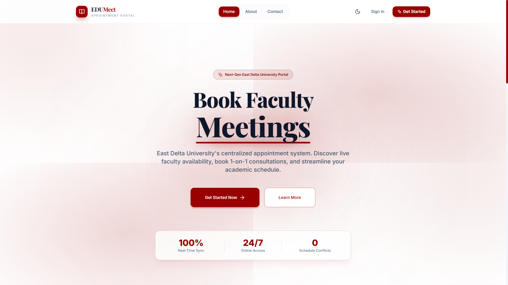
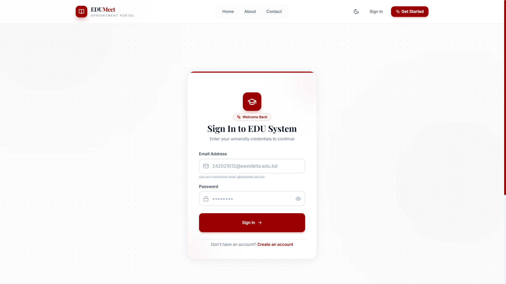
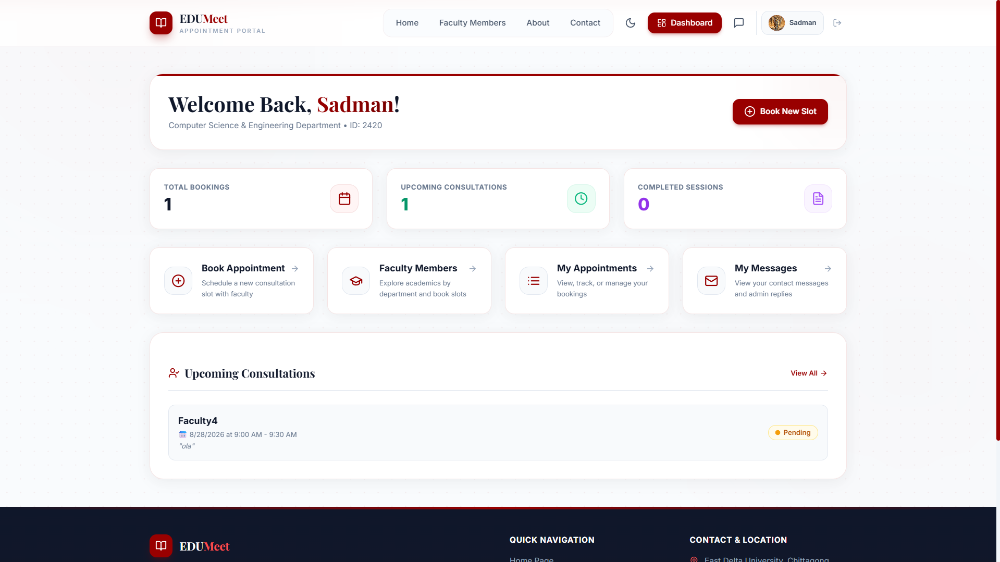
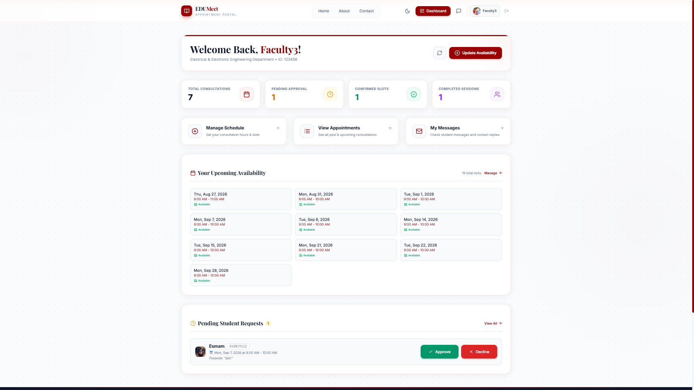
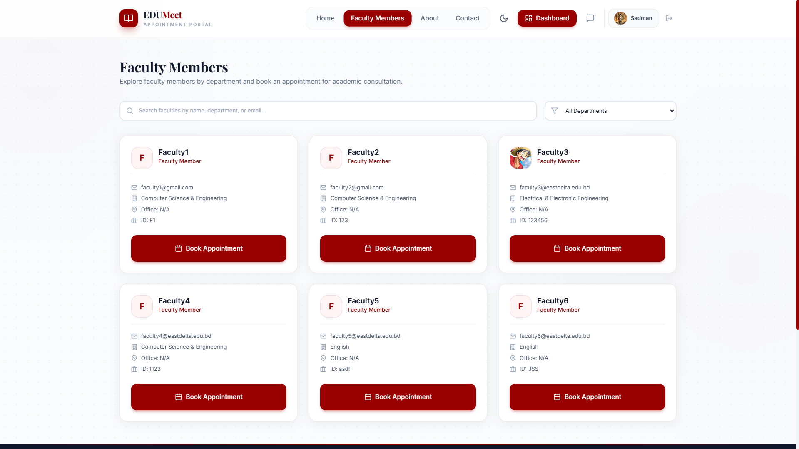
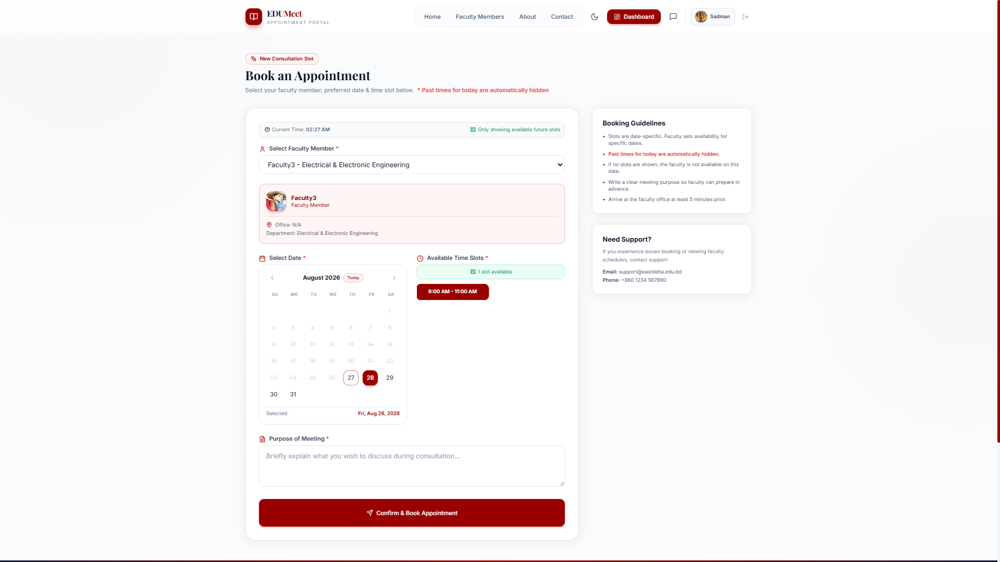

# 🎓 EDU Meet — Faculty Appointment Booking System

> A centralized appointment-management platform that helps East Delta University (EDU) students and faculty schedule, manage, and track meetings efficiently.

## Project Overview

**EDU Meet** replaces ad-hoc appointment requests with a structured, role-based workflow. Students can discover faculty members, view available slots, and submit appointment requests. Faculty members manage their schedules and appointment decisions, while administrators oversee users, faculty records, appointments, contact messages, and system settings.

The application is responsive, supports light and dark themes, and provides separate dashboards for students, faculty members, and administrators.

## Features

### Student

- Register with email verification via one-time password (OTP).
- Browse and search faculty members.
- Check available appointment slots and book meetings.
- View, track, and cancel appointments when permitted.
- Update profile details and view replies to contact messages.

### Faculty

- Manage availability schedules and time slots.
- View upcoming and historical appointments.
- Confirm, complete, or cancel appointment requests.
- Maintain faculty profile information.

### Administrator

- View platform statistics and appointment activity.
- Manage users, faculty profiles, and faculty records.
- Review appointments across the platform.
- Manage system settings and maintenance mode.
- Read, reply to, and manage contact messages.

### Platform

- Role-based access control for student, faculty, and admin accounts.
- JWT-protected API routes and password hashing.
- Appointment statuses: `pending`, `confirmed`, `cancelled`, and `completed`.
- REST API documentation with Swagger UI.
- Responsive React interface with transitions, notifications, and theme switching.

## Technology Stack

| Area | Technologies |
| --- | --- |
| Frontend | React, Vite, React Router, Tailwind CSS, Axios, Framer Motion |
| Backend | Node.js, Express, Mongoose |
| Database | MongoDB |
| Authentication | JWT, bcryptjs, email OTP verification |
| Email | Brevo API or Nodemailer |
| API documentation | Swagger / OpenAPI |
| Deployment | Vercel-ready frontend configuration |

## Screenshots

| Home | Login |
| --- | --- |
|  |  |

| Student dashboard | Faculty dashboard |
| --- | --- |
|  |  |

| Faculty directory | Book appointment |
| --- | --- |
|  |  |

## Getting Started

### Prerequisites

- Node.js 18 or later
- npm
- A MongoDB instance (local or MongoDB Atlas)
- An email provider configuration for OTP emails (optional for local development, required for registration email delivery)

### 1. Clone the repository

```bash
git clone https://github.com/nibirch0wdhury/EDU-Faculty-Appointment-Booking-System.git
cd EDU-Faculty-Appointment-Booking-System
```

### 2. Configure environment variables

Create `server/.env`:

```env
PORT=5000
NODE_ENV=development
MONGODB_URI=mongodb://127.0.0.1:27017/edu_appointment
JWT_SECRET=replace-with-a-long-random-secret
FRONTEND_URL=http://localhost:5173

# OTP email delivery — Brevo API (recommended by this project)
BREVO_API_KEY=your-brevo-api-key
BREVO_SENDER_EMAIL=no-reply@example.com
BREVO_SENDER_NAME=EDU Meet
OTP_EXPIRY_MINUTES=10

# Optional: used by Swagger when generating an external API URL
BACKEND_URL=http://localhost:5000/api
```

Create `client/.env`:

```env
VITE_API_URL=http://localhost:5000/api
```

Never commit real credentials. The repository already ignores `.env` files.

### 3. Install dependencies

```bash
cd server
npm install

cd ../client
npm install
```

### 4. Run the application

Open two terminals from the project root.

```bash
# Terminal 1 — API server
cd server
npm run dev
```

```bash
# Terminal 2 — React client
cd client
npm run dev
```

Open the client at [http://localhost:5173](http://localhost:5173). The API runs at `http://localhost:5000` by default.

## API Documentation

With the backend running, interactive API documentation is available at:

```text
http://localhost:5000/api-docs
```

A JSON OpenAPI specification is also served at `http://localhost:5000/api-docs.json`. The API health endpoint is `GET /api/health`.

## Project Structure

```text
EDU-Faculty-Appointment-Booking-System/
├── client/                         # React + Vite application
│   ├── src/
│   │   ├── components/              # UI and role-specific components
│   │   ├── context/                 # Authentication and theme providers
│   │   ├── hooks/                   # API-facing React hooks
│   │   ├── pages/                   # Public pages
│   │   └── utils/api.js             # Axios client configuration
│   └── package.json
├── server/                         # Express REST API
│   ├── config/                      # Database configuration
│   ├── controllers/                 # Request handlers
│   ├── middleware/                  # JWT and role middleware
│   ├── models/                      # Mongoose schemas
│   ├── routes/                      # API routes
│   ├── services/                    # Email service
│   ├── swagger.js                   # OpenAPI configuration
│   └── server.js                    # API entry point
├── screenshots/                     # README screenshots
└── vercel.json                      # Frontend SPA rewrite configuration
```

## Deployment

The frontend is configured for Vercel. Set the frontend root directory to `client`, use `npm run build`, and configure `VITE_API_URL` with the deployed API URL.

Deploy the `server` directory to a Node.js hosting service, then configure its production environment variables, including `MONGODB_URI`, `JWT_SECRET`, `FRONTEND_URL`, and the email-provider values. Update `FRONTEND_URL` to your deployed client domain so the API can accept browser requests from it.

## Live Deployment

| Resource | Link |
| --- | --- |
| Application | [meet-edu.vercel.app](https://meet-edu.vercel.app/) |
| Backend API | [edu-faculty-appointment-booking-system.onrender.com](https://edu-faculty-appointment-booking-system.onrender.com/) |
| Swagger API documentation | [Open Swagger UI](https://edu-faculty-appointment-booking-system.onrender.com/api-docs/) |
| Source code | [GitHub repository](https://github.com/nibirch0wdhury/EDU-Faculty-Appointment-Booking-System) |

## Team — Error 404!

| Name | Responsibilities | Student ID |
| --- | --- | --- |
| Sadman Chowdhury | Deployment, Authentication, Security, Middleware, Email Service | `242021012` |
| Muhammad Sharfuddin | Database, Models, CRUD, API Endpoints| `242020612` |
| Yeaser Bin Osman Esmam | React Components, UI/UX, CSS, Animations| `242019112` |
| Ashraful Islam Sikder | State Management, Routing, API Integration, Forms| `242024212` |

## Contributing

1. Fork the repository.
2. Create a branch: `git checkout -b feature/your-feature`.
3. Commit your changes and push the branch.
4. Open a pull request with a clear description of the change.
4212` |

---
